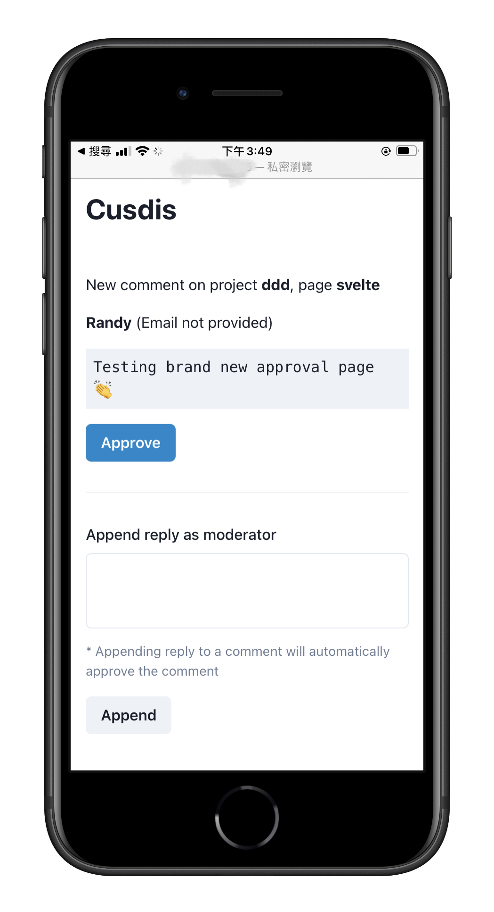

## New Approval Page

The main new feature we release in `v1.1.3` is a new approval page. In the pass, we provide a `Approve without login` button in the notification Email, to help user approve the comment without open their computer and sign in to the dashboard.

We think it's not enough. In addition to just approve the comment, we want user can reply the comment without sign in too. So we provide a new approval page, users can approve or reply the comment in a single page, without sign in.

This approval page link will be sent to your notification email and comment [Webhook request body](https://cusdis.com/doc#/advanced/webhook). It will be expired in 31 days.

## Enhancements

- Support language `tr`. Thanks to @selimdoyranli
- Support language `pt-BR`. Thanks to @lbcnz
- Support language `oc (Occitan)`. Thanks to @Mejans
- Click the `reply` button on widget can now toggle the reply form.
