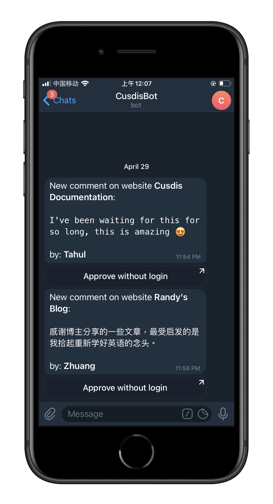

Since Cusdis have [Webhook](https://cusdis.com/doc#/advanced/webhook) support, users can integrate Cusdis with their own tools. I'm a huge fan of Telegram, which is a messaging app with a focus on security and speed. I made a Telegram bot for my own, when I have new comment on my blog, I will receive a message in Telegram and I can also approve or reply without login:

I notice that we have some users are using Telegram too. It makes me think about making my bot public and every Telegram users can use without implementing their own bot server.

So we are introducing our official Telegram bot now. It's super easy to setup:

1. Open and start bot https://t.me/CusdisBot
2. send `/gethook` command
3. Copy the URL result and paste in Cusdis project's webhook settings

Besides, this bot works for both hosted service and self-host service. 

See more about the Webhook in [documentation](https://cusdis.com/doc#/advanced/webhook).